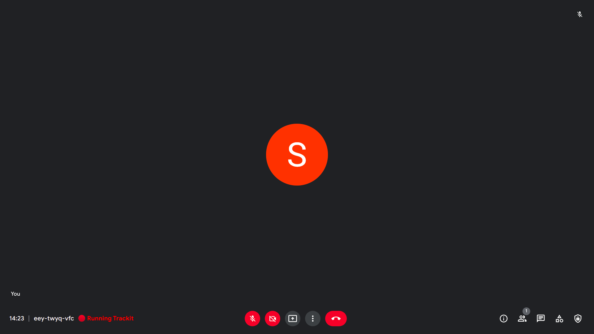
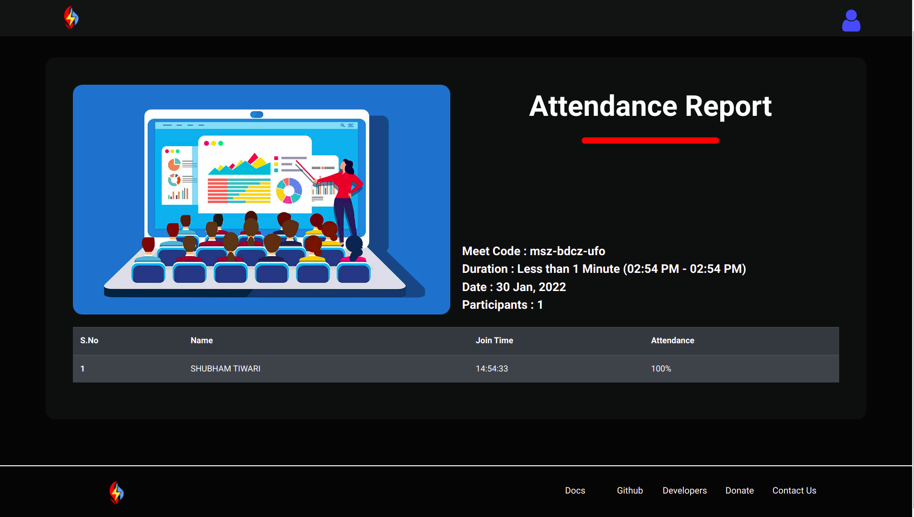

# Trackit

###### Chrome Extension

Automatically save attendance during google meet video calls.

The extension records attendance automatically when you are in a meet and saves it. Once the meet is over it will open the attendance report in a new tab. You can access your saved attendance data anytime on our website [https://meetattendance.herokuapp.com](https://meetattendance.herokuapp.com).

## Donate

[https://www.buymeacoffee.com/blaze2004]()

### Images 🚀

---

1). The extension starts automatically when you enter in a meet.

2). Once, the meet is  over your attendance report is displayed in a new tab.

no manual work required ! it's fully automatic.




## Data Format

```
{
    "attendance": {
        "meetCode": "",
        "startTime": "",
        "stopTime": "",
        "date": "",
        "meetDuration": "",
        "participants": {
            "identifier-profile-picture-link": {
                "name": "Kanha",
                "joinTime": "",
                "attendedDuration": "",
                "attendance": [
                    1,
                    0,
                    0,
                    1,
                    1,
                    1,
                    1,
                    1,
                    1,
                    0,
                    1
                ]
            },
            "identifier": {
                "name": "Alex",
                "join_time": "",
                "attendance": [
                    1,
                    1,
                    1,
                    1,
                    1,
                    1,
                    1,
                    1,
                    1,
                    0,
                    1
                ]
            }
        }
    }
}
```
